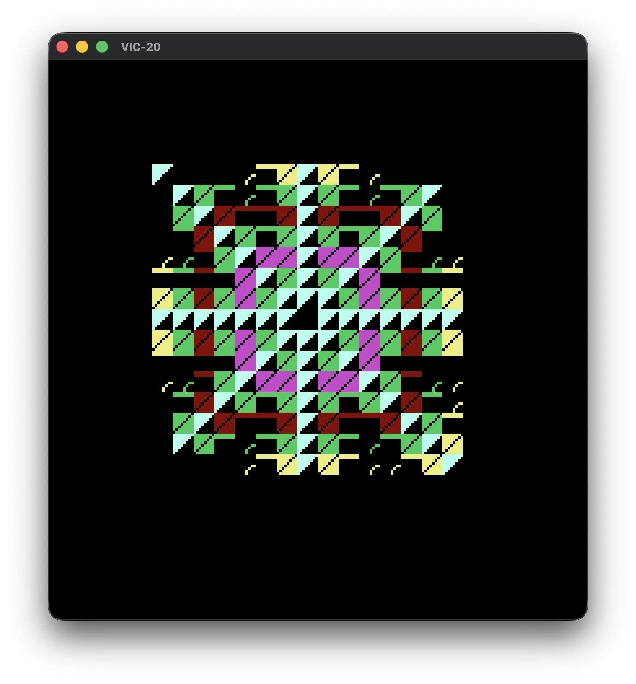

# rusty-vic20

Still a WIP.

## Plan

- [x] 6502 CPU core.
- [x] VIC chip, rendering VIC-20 text from screen memory.
- [x] On screen VIC-20 keyboard
- [X] VIA 2 chip (driving interrupts, etc)
- [X] Integration testing.
- [X] VIA 1 chip
- [X] Keyboard interaction.
- [ ] Load basic programs (maybe cut and paste)
- [ ] Sound.
- [ ] Joystick support
- [ ] Load programs from cassette or binary data.
- [ ] Speed control.
- [ ] Accurate emulation down to the cycle and raster level.
- [ ] Lightpen

## Vic 20
```
cargo run --bin vic20
```




## Disassembler

Run the disassembler on a binary file:


```
cargo run --bin disassembler -- data/somefile.bin
```

