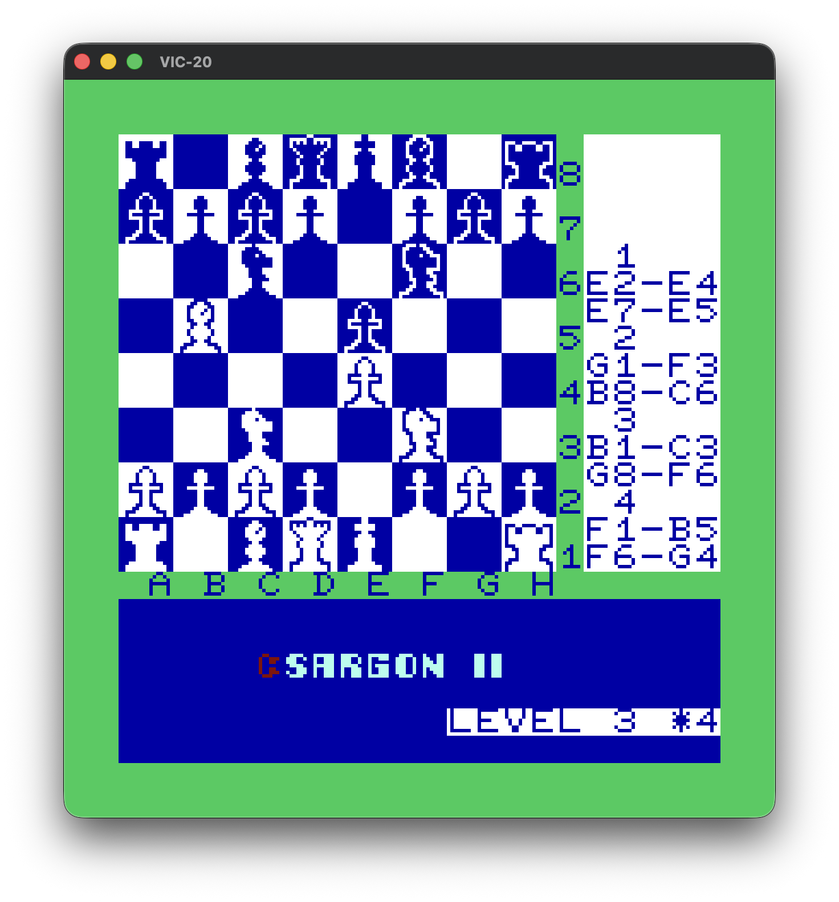

# rusty-vic20

A Vic 20 emulator written in Rust.

## Requirements
- Apple Silicon Mac
- Linux (tested on Ubuntu)
- Rust 2024 Edition Nightly

## Features
- Vic 20 emulator
  - Not cycle accurate but good to play games.
- Well tested code base on single threaded core in understandable Rust
- Control panel
  - Loading .prg files
  - Joystick
  - Speed control
  - Memory expansion: 3K, 8K, 16K, 32K
- Virtual keyboard
- Cut and paste directly onto the Vic screen.

## Usage
```
cargo run --release --bin vic20
```

## Screenshots


!

## Disassembler

Run the disassembler on a binary file:

```
cargo run --bin disassembler -- data/somefile.bin
```

